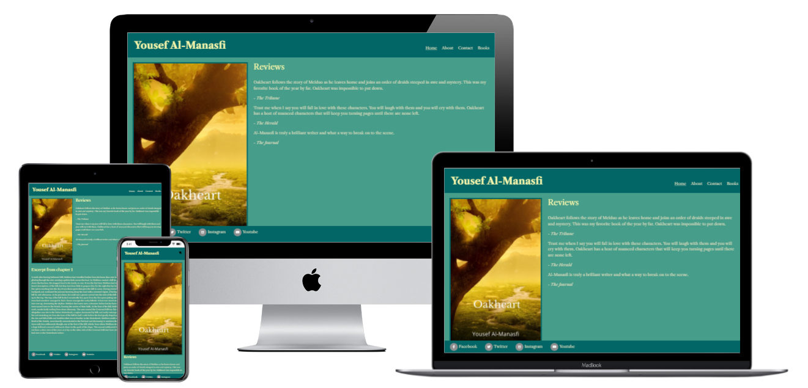

# Code Institute First Milestone Project

## Yousef Al-Manasfi's Author Website

## Introduction

This website is designed as an authors main webiste. It is a place to display their work as well as provide personal
information, contact info, and social media links. The primary purpose is to bring prospective readers to the authors
work, and as a space for current followers of their work to get info on new releases. The author discussed
on this website is fictional though some of the work is taken from my own writing and I have used my own name. 

## User Experience (UX)

### User Stories
      First time Visitor Goals
         1. As a first time visitor, I want to know more about the author and their works.
         2. As a first time visitor, I want to be able to easily navigate the website.
         3. As a first time visitor, I want to get an idea of the quality of the authors work and know where
            I can purchase their books.
      
      Returning Visitor Goals
         1. As a returning visitor, I want to easily find new and up to date informaion on book releases.
         2. As a returning visitor, I want to know where to sign up to receive regular updates and the
            latest news.
      
      Frequent Visitor Goals
         1. As a frequent visitor, I want to know how to contact the author.
         2. As a frequent visitor, I want to know where to find the autors social media.

### Design
      - Colour Scheme
      
      Two primary colours have been used for the background of the site. These colours are Skobeloff and Polished Pine, they were chosen by using [Coolors](https://coolors.co/). Two colors were used for the text both are varying shades of yellow green. The colours were chosen to fit the aesthetic of the authors work and maintain a fantasy like feeling.

      - Typography
      
      The primary font that has been used across the website is Libre Calson Tect, Serif has been used as a back up font in case the primary font fails to load. This font was chosen because it maintains an aesthetic matching the authors style while being clean and easy to read.

      - Imagery
      
      The images used are all reflections of the authors work. Three images have been used across the website. Two of them are book covers, these are important in drawing prospective readers attentions to the authors work. There is also an image of the author which has been used to fill space and catch the users attention.

### Wireframes

- Home page [Wireframe](assets/wireframes/wireframehome.png)
- About page [Wireframe](assets/wireframes/wireframeabout.png)
- Contact page [Wireframe](assets/wireframes/wireframecontact.png)
- Books page [Wireframe](assets/wireframes/wireframebooks.png)

## Technologies Used
   
### Languages
      - [HTML5](https://en.wikipedia.org/wiki/HTML5)
      - [CSS](https://en.wikipedia.org/wiki/CSS)

### Frameworks, Libraries, and Other Resources
   1. [Bootstrap](https://getbootstrap.com/) v5.13:
      - Bootstrap was used for responsiveness and design of the website.
   2. [Google Fonts](https://fonts.google.com/):
      - Google fonts was used to import the 'Libra Calson Text' font into all html files.
   3. [Font Awesome](https://fontawesome.com/):
      - Font Awesome was used throughout the webiste to add icons for aesthetic and UX purposes.
   4. [jQuery](https://jquery.com/):
      - jQuery came with Bootstrap as part of the navbar responsiveness.
   5. [GitPod](https://www.gitpod.io/):
      - GitPod was used for version control by utilizing the Gitpod terminal to commit to Git or Push to Github.
   6. [GitHub](https://github.com/):
      - GitHub is used to store the projects code after being pushed from Git.
   7. [Balsamiq](https://balsamiq.com/):
      - Balsamiq was used to create the wireframes during the design process.
   8. [Canva](https://www.canva.com/):
      - Canva was used to create the book covers for Oakheart and Time of
      Decay. The images were free license images taken from pixabay.
   9. [pixabay](https://pixabay.com/):
      - Used pixabay to source license free images. The only image taken from pixabay were for the two book covers. Other images were sourced from personal photo collections.
   10. [inkarnate](https://inkarnate.com/):
      - This was also used to create a [map](assets/images/ostia.jpg) of the authors world although it did not remain in the final version of the website.

### Testing

#### User Story Testing

- First time Visitor Goals
   1. As a first time visitor, I want to know more about the author and their works.
      - first time visitors can get this information from the about author page and books page
      as well as find an excerpt of the authors work on the home page.

   2. As a first time visitor, I want to be able to easily navigate the website.
      - Navigation throughout the site is easily accessed from the main menu in the top right hand
      of the webpage. On samller device screens where the menu collapses there is a scroll icon in
      in place of a menu button. There are no hidden page everything is accessible via the menu.

   3. As a first time visitor, I want to get an idea of the quality of the authors work and know where
      I can purchase their books.
      - First time visitors can get an idea quality of the authors work directly from the home page.
      They will find reviews here as well as an excerpt of the authors work.
      
- Returning Visitor Goals
   1. As a returning visitor, I want to easily find new and up to date informaion on book releases.
      - Returning visitors who may want to find new information on the authors work can navigate
      to the books page where this will all be dispalyed. The authors social media links are also
      accessible from the footer of every page, they will be able to find any updates here.

   2. As a returning visitor, I want to know where to sign up to receive regular updates and the
      latest news.
      - The contact page provides a form that will allow visitors to sign up to a newsletter with
      all the latest information.
      
- Frequent Visitor Goals
   1. As a frequent visitor, I want to know how to contact the author.
      - Visitors who may want to contact the author directly regarding their work will find an address
      they can write to on the contact page. 

   2. As a frequent visitor, I want to know where to find the autors social media.
      - The authors social media links are accessible from the footer of every page of the website.
    
#### Browser Testing

The website has been tested in Google Chrome, Microsoft Edge, Safari and Firefox. The websites works as intended across these different browsers.

It has been tested on two mobile devices a Huawei and Samsung. The website works as intended on both devices.

#### Local Testing

I have tested all of the navigation links and links to external sites, they all work as intended. 

I have tested the form and this works without any issues.

#### Validators

The websites has been through the W3C validators with 0 errors.

HTML:
- [Home](assets/validator/htmlvalidatorhome.png)
- [About](assets/validator/htmlvalidatorabout.png)
- [Contact](assets/validator/htmlvalidatorcontact.png)
- [Books](assets/validator/htmlvalidatorbooks.png)

#### Responsivenes

I have tested the responsiveness of the website using Chrome Dev Tools. Everything works accordingly and the website responds correctly to the breakpoints set using Bootstrap.

#### Lighthouse testing

Home page:
- [Desktop](assets/images/lighthousetestinghomedesktop.png)
- [Mobile](assets/images/lighthousetestinghomemobile.png)

About page:
- [Desktop](assets/images/lighthousetestingaboutdesktop.png)
- [Mobile](assets/images/lighthousetestingaboutmobile.png)

Contact page:
- [Desktop](assets/images/lighthousetestingcontactdesktop.png)
- [Mobile](assets/images/lighthousetestingcontactmobile.png)

Books page:
- [Desktop](assets/images/lighthousetestingbooksdesktop.png)
- [Mobile](assets/images/lighthousetestingbooksmobile.png)

#### Issues

To resolve an issue with text overlapping images and pixelation/distortion of images on some 
medium to smaller screen sizes I set the width of images to 100%. This works well on samller
all screen sizes in terms of the position of content across all pages. However, on some large
screen sizes this creates some large images and empty spaces. The images are still clear and
not distorted. This was deemed acceptable as it is a mobile first approach and fits nicely
with the design and layout on smaller devices without causing any issues that aren't aesthetic on
larger device screens. 

### Version Control

#### Git & GitHub

I used GitPod as an IDE and Github as a remote reposiory.

- To start with I created a respository on GitHub using Code Institutes
template.
- I then opened the repository in GitPod where I wrote my code.
- The code written in GitPod was pushed to GitHub.

### Deployment

I deployed the website on GitHub pages using the following steps:

   1. Go to "Settings" in your respository.
   2. Select "Pages" from the left hand menu.
   3. Select the branch and folder then save.
   4. The website is now running on GitHub pages.
